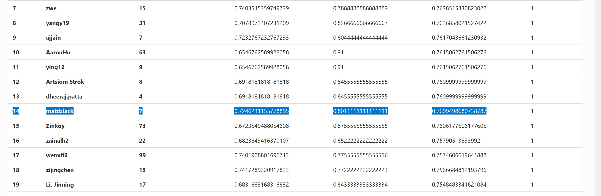

# CS 410 Text Information Systems 
# Final Course Project 
# Team: The Classifiers

# Members
Praveen Pathri (ppathri2@illinois.edu)  
Steven Piquito (piquito2@illinois.edu)  
Mattias Rumpf (mrumpf2@illinois.eu) - captain

# Project Topic
Option 4: Text Classification Competition - Sarcasm Detection on Twitter data

# Project Setup and Individual Contributions
The submitted work represents a well balanced team effort: Each of the members spend considerable time on researching potential models and frameworks. Praveen and Steven worked on and tested baseline models like SVM and random forest, Matthias focused on pre-trained models. When BERT type models turned out to be the most promising, we jointly concentrated on improving the performance of a fine tuned RoBERTa model. Praveen looked into improving accuracy via data preparation, Steven added context, Matthias experimented with hyperparameter tuning. 

# What we do
*  We are fine tuning RoBERTa. RoBERTa, a neural language model that extends BERT and was pre-trained on even more massive amounts of text data, e.g. Wikipedia and news articles with a dynamically chaning masking pattern for the missing word prediction task.
*  We have experimented with basic NLP models such as SVM, Random Forest, Naive Bayes (see our progress report in Appendix I)
*  We do employ some basic data cleaning like stop word removal, further experimentation into data preparation has not improved model performance.
*  We simply concatenated all context to the twitter response that was available.
*  We experimented with hyperparameter tuning on google colab (to exploit their GPU offerings) and found a learning rate of 2.741032760877178e-05 and number of epochs equal 4 for fine-tuning to allow us generating predictions that beat the baseline (see appendix II and III).

# Result
We beat the baseline using the fine-tuned RoBERTa model (user mattblack):

# Running our Code and replicating results

## Screencast tutorial
Please follow the screencast tutorial which is available at
*   x

## Install instructions
To install all required libraries we assume that users have a recent install of the Anaconda distribution with Python <=3.7  
If you run into trouble feel free to contact use (preferably Matthias: mrumpf2@illinois.edu)
Instructions for windows users (for other OS adapt accordingly)
* copy / clone the project repository to your working directory e.g.:  C:\UIUC\TextMining\FinalProjectSubmission
* Open Anaconda Navigator and create a new python 3.7 environment
* Install and open the Anaconda App "cmd prompt", check that the newly created environment is activated
* go to https://pytorch.org/get-started/locally/ and get your install command  
e.g. conda install pytorch torchvision torchaudio cudatoolkit=10.2 -c pytorch  
or without cpu conda install pytorch torchvision torchaudio cpuonly -c pytorch
* run the install command in the cmd prompt
* enter in cmd prompt: pip install simpletransformers jsonlines pandas transformers nltk torch
* cd to your working directory e.g.: cd C:\UIUC\TextMining\FinalProjectSubmission
* then start notebooks by entering in cmd prompt: jupyter notebook

# Main document: Project Report Team The Classifiers - Twitter Sarcasm Detection (with a fine-tuned RoBERTa model)
We use RoBERTa as our workhorse model, see https://paperswithcode.com/method/roberta  
To replicate our results run the following notebook
* Jupyter Notebook see <a href="1. Project Report and Classifier Code Team The Classifiers - Twitter Sarcasm Detection.ipynb">1. Project Report and Classifier Code Team The Classifiers - Twitter Sarcasm Detection.ipynb</a>
* PDF see <a href="1. Project Report and Classifier Code Team The Classifiers - Twitter Sarcasm Detection.pdf">1. Project Report and Classifier Code Team The Classifiers - Twitter Sarcasm Detection.pdf</a>

## Appendix I.The progress report - initial experimentation
* Jupyter Notebook see "Appendix I.The progress report - initial experimentation.ipynb"
* PDF see "Appendix I.The progress report - initial experimentation.pdf"

## Appendix II.  Google Colab Hyperparameter tuning
use colab at https://colab.research.google.com/  
if you want to test the code, note that you need to upload the data folder to your google drive, replace folder paths, and connect to google drive from with the colab notebook
* Jupyter Notebook see "Appendix II. Hyperparameter tuning.ipynb"
* PDF  see "Appendix II. Hyperparameter tuning.pdf"

## Appendix III. Google Colab Roberta Training and Sarcasm Prediction
**use this code if you don't have a GPU to speed up training the model and retrieving the prediction results**  
use colab at https://colab.research.google.com/  
if you want to test the code, note that you need to upload the data folder to your google drive, replace folder paths, and connect to google drive from with the colab notebook
* Jupyter Notebook see "Appendix III. Roberta Training and Sarcasm Prediction.ipynb"
* PDF  see "Appendix III. Roberta Training and Sarcasm Prediction.pdf"